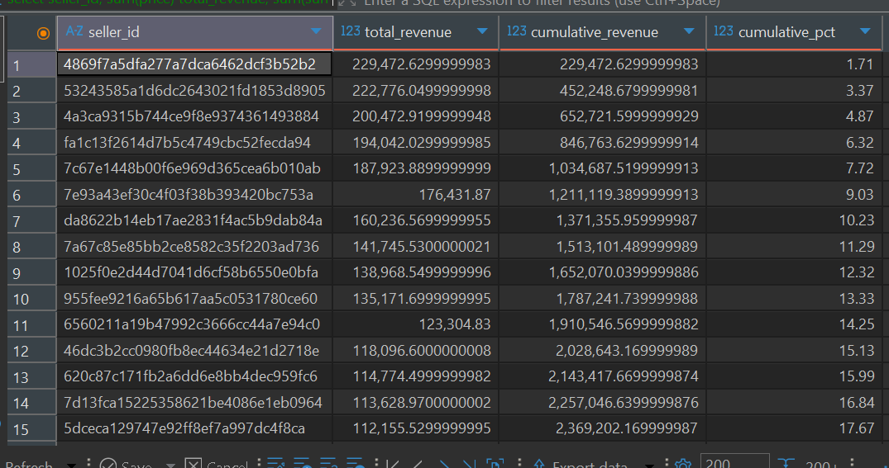
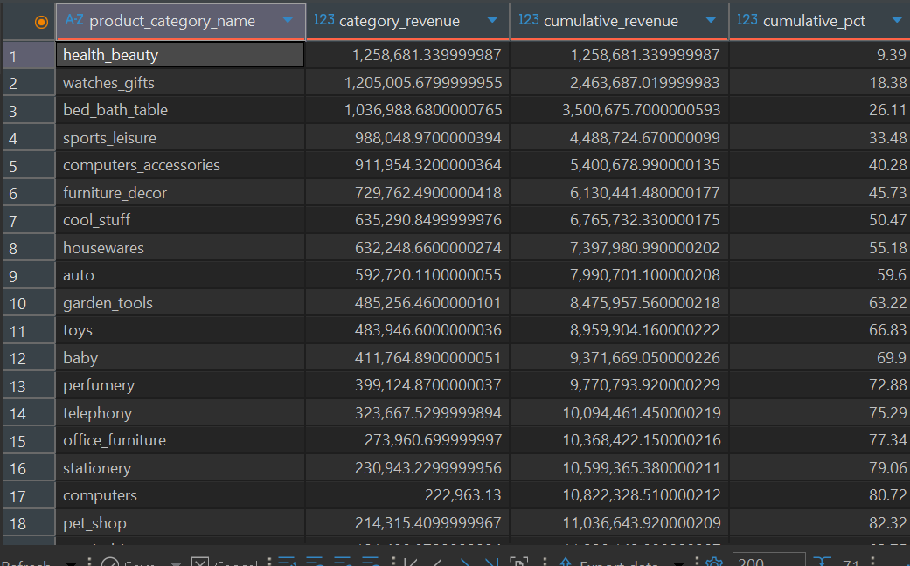
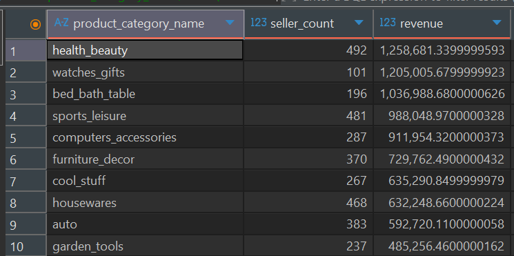

# Documenting_Practice
## 🛒 Olist E-Commerce SQL Analysis

## Project Overview
This is a mini analysis carried out on a Brazilian E-commerce store to practice relational database querying. That is to say, the analysis will be carried out purely with MySQL. In this analysis, I will be looking at the sales, product category, seller and customer insights that can help optimize the business.

## 🎯 Objectives

- Explore the Olist dataset using SQL.

- Identify top sellers and their contribution to total revenue.

- Analyze revenue distribution across product categories.

- Investigate customer repeat purchase behavior(Later).

- Track revenue growth patterns over time(Later).

## Dataset and Source

- **Name:** Brazilian E-Commerce Public Dataset by Olist
  
- **Source:** [Kaggle -- Olist E-Commerce Dataset](https://www.kaggle.com/datasets/olistbr/brazilian-ecommerce)

- **Description:**
  - Covers orders placed from 4th September 2016 to 17th October 2018.
  - Includes 97k+ Orders With details on customers, sellers, product category, payments, reviews and delivery perfomance.
  - Multiple tables are related by order_id, customer_id, product_id and seller_id.
 
## Tools Used

- **SQL** (MySQL)

## EDA and Key Queries

1. **Dataset Overview**

   - Number of Sellers: 3,033
   -  Number of Distinct Orders: 97,256
   -  Number of Items Sold: 111,023
   -  Number of Products Categories: 77
  
       ```sql
         select count(distinct seller_id), 
          count(distinct order_id),
         count(product_id),  
        count(distinct product_category_name)
        from order_items2;
      ```

   - Number of Customers: 99,441

     ```sql
     select count(distinct customer_id)
     from olist_customers_dataset o
     ```
  - Total Sales Revenue In BRL/R$: 13,406,593.940013679

    ```sql
        select SUM(price) total_sales_Revenue 
        from order_items2;
    ```
    
2. **Top Sellers by Revenue:**

   - **Top 10 Sellers:**
   
     Total revenue for the top 10 sellers(In BRL/R$) is 1,787,241.739999. This reperesents 13.33% of the total revenue generated. In essence, top 0.33% of the sellers             generates 13.33% of the total revenue. While this is significant, it also shows that to an extent, Olist is not heavily reliant on the top few sellers. Based on this          alone, sales are somewhat spread out.

   ```sql
   select sum(sales_revenue) total_top10_rev
   from 
	 (select seller_id, count(order_id) sales_volume, SUM(price) sales_Revenue 
	 from order_items2
	 group by seller_id
	 order by 3 desc
	 limit 10
		) as top10;
    ```

   ```sql
    select SUM(price) total_sales_Revenue, 1787241.739999988 * 100/SUM(price)
    from order_items2;
    ```

   - **Top 100 Sellers:**

   The top 100 contributed 45.37% of the total revenue. From this analysis, we see that even the top 100 sellers do not make up half of the revenue. Out of 3,033 sellers,       2,933 account for 55%. This shows that the store's sales revenue is spread out meaning, if one top seller leaves, the impact on revenue will be limited. It highlights       that the long tail of smaller sellers is really the back bone here. Supporting these smaller sellers, for example, by increasing their visibility, will go a long way 		in boosting overall revenue.

   ```sql
   select sum(sales_revenue) total_top100_rev
   from 
	(select seller_id, count(order_id) sales_volume, SUM(price) sales_Revenue 
	from order_items2
	group by seller_id
	order by 3 desc
	limit 100
		) as top100; 
    ```

```sql
  select SUM(price) total_sales_Revenue, 6083000.989999993 * 100/SUM(price)
  from order_items2;
  ```
   
And to further cement the above insight, I carried out a cumulative revenue calculation by seller using window function, attached below is the query.

```sql
	select seller_id,
	   sum(price) total_revenue,
	   sum(sum(price)) over (order by sum(price) desc) cumulative_revenue,
	   round(
	   		sum(sum(price)) over (order by sum(price) desc)
	   		/sum(sum(price)) over() * 100, 2
	   		) as cumulative_pct
	from order_items2
	group by seller_id
	order by 2 desc;
```

This allowed me to rank the sellers by revenue contribution and compute the cumulative share across all 3,033 sellers as seen below.



Now to understand where this revenue is coming from, next is to examine the performance by product category.

3. **Product Categories insights**

The total revenue generated by the top 5 categories is 540,0678.99 in BRL. This represents 40.28% of the total revenue generated by all categories. For top 10 product categories, total rev is 847,5957.56 in BRL and this represents 63.22% of the total revenue. So out of 71 product categories, the top 10 makes up more than half the total revenue, this goes to show that the business is heavily reliant on the top selling categories. In a nut shell, revenue is seller diverse but product concentrated. If the platform wants to grow revenue fast, they should focus more on the top selling categories, because that is where most of the money comes from. But if they want to grow customer reach, they should nuture smaller categories.

I also carried out a cumulative revenue calculation based on product categories with query and result attached below.


```sql
	SELECT product_category_name, 
	   SUM(price) AS category_revenue,
	   SUM(SUM(price)) OVER(ORDER BY SUM(price) DESC) AS cumulative_revenue,
	   ROUND(
	   		SUM(SUM(price)) OVER(ORDER BY SUM(price) DESC)/SUM(SUM(price)) OVER() * 100, 2
	   		) AS cumulative_pct
	FROM order_items2 o 
	GROUP BY product_category_name
	ORDER BY 2 DESC;

```



and from the result, you can clearly tell how concentrated the revenue source is. We can see that top 17 categories generated 80.72% of the total revenue out of 71 categories. This confirms our earlier insight that the platform is very much dependent on the top categories.

4. **Product Category Sellers Comparison**

The goal here is to determine how many sellers per product category compared to the revenue generated by the said category. This will help in highlighting highly competitive categories and the less competitive ones. let's take a look at the query below.

   ```sql
		SELECT product_category_name, count(DISTINCT seller_id) seller_count, SUM(price) revenue 
		FROM  order_items2
		GROUP BY 1
		ORDER BY 3 DESC;
   ```



From the above we can tell some categories are concentrated, while others are fragmented. Health and beauty for instance generated the most revenue but with 492 sellers, the competition is much. New sellers venturing into this category might find it very difficult to establish/scale hence might not play a significant role in improving revenue. Other categories like the Watch_gifts has just 101 sellers but generated the second largest revenue by category. This means watch_gift sellers are more likely to sell because of lesser competition and a large pool to benefit from, Onboarding new sellers into this category will increase supply, potentially improving revenue.
